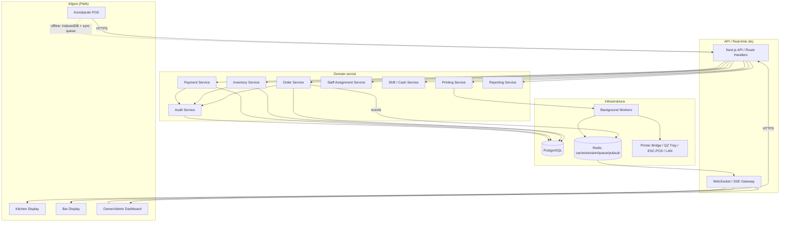
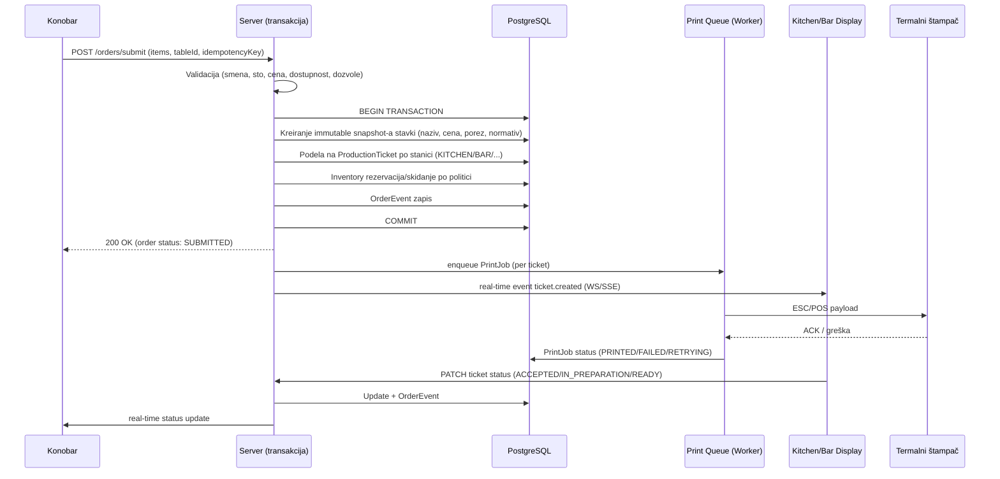

# Restaurant Control System — Predimplementacioni plan

---

## 1. Executive Summary

Restaurant Control System (RCS) je multi-tenant SaaS platforma za upravljanje restoranom koja pokriva ceo operativni lanac: od konobara i stolova, preko kuhinje/šanka i štampanja tiketa, do inventara, normativa, zaduženja osoblja, smena/kase, plaćanja, izveštaja i audit kontrole. Sistem se gradi kao produkciona web aplikacija (Next.js App Router + PostgreSQL + Prisma), mobilno optimizovana za konobarski i vlasnički rad, sa PWA/offline podrškom i real-time komunikacijom (WebSocket/SSE + Redis).

Ključni arhitektonski principi:
- **Server je izvor istine.** Sve cene, poreze, popuste i stanje robe računa i validira server unutar DB transakcija — frontend/PIN/browser se nikada ne smatraju pouzdanim.
- **Immutable event log, ne mutacija.** Porudžbine, stavke i inventar se menjaju kroz događaje (snapshot + event), nikad tihim prepisivanjem — obezbeđuje punu istoriju i audit.
- **Multi-tenant od dana 1.** Svaka poslovna tabela nosi `tenantId`/`restaurantId` (+ `locationId` gde treba); izolacija se sprovodi na nivou upita i middleware-a, ne samo na UI.
- **Printing i fiskalizacija su apstrahovani.** `PrintingProvider` i `FiscalizationProvider` interfejsi omogućavaju kasniju zamenu/dodavanje implementacija bez menjanja poslovne logike.
- **Offline-first za konobarski POS.** IndexedDB + sync queue + idempotency keys, uz jasnu offline oznaku dok server ne potvrdi.

Naziv projekta: **Restaurant Control System (RCS)**.

---

## 2. Potvrda razumevanja poslovnog procesa

- Konobar radi isključivo unutar aktivne smene, na dodeljenoj lokaciji; PIN prijava na registrovanom uređaju, email/lozinka za administraciju.
- Porudžbina prolazi kroz stroг tok statusa (DRAFT → SUBMITTED → ... → PAID/CANCELLED/VOIDED), sa serverskom validacijom pre svakog prelaza i nepromenljivim snapshot-om cene/naziva/normativa u trenutku slanja.
- Svaka stavka se automatski rutira na production station (KITCHEN/BAR/GRILL/...) i deli u zaseban tiket po stanici; tiketi se pojavljuju real-time na KDS/Bar Display i štampaju se preko apstraktnog printing sloja.
- Inventar se vodi kao ledger (ne kao brojač) — svako kretanje (prodaja, otpis, prijem, transfer, zaduženje, korekcija) ostaje trajno zabeleženo; storniranja generišu suprotno kretanje, ne brisanje.
- Zaduženje osoblja je posebna evidencija (izdato → prodato/otpisano/vraćeno → manjak/višak) koja se zatvara na kraju smene zajedno sa kasom.
- Osetljive radnje (veliki popust, storno, korekcija stanja, ponovno otvaranje računa) prolaze kroz approval workflow sa PIN odobrenjem menadžera.
- Fiskalizacija nije deo prve verzije — dokumenti se jasno označavaju kao "Radni nalog" / "Predračun", a integrација se pravi kroz interfejs za kasnije sertifikovano rešenje.
- Sistem je pripremljen za više restorana/lokacija/magacina/kuhinja/šankova/štampača/menija/cena po lokaciji, iako prva produkciona upotreba može biti jedan restoran.

---

## 3. Predlog arhitekture

**Slojevi:**

1. **Client (PWA)** — Next.js App Router, React, Tailwind + shadcn/ui, TypeScript strict. Tri glavna UI konteksta: (a) Konobarski touch POS (mobile-first), (b) KDS/Bar Display (tablet/TV, touch), (c) Admin/Owner panel (desktop-first, responsive).
2. **API sloj** — Next.js Route Handlers (REST) + tRPC ili dedikovani API rute za tipizirane pozive; Zod validacija na granici; sve mutacije prolaze kroz servisni sloj, ne direktno kroz Prisma iz route handlera.
3. **Domain/Service sloj** — feature-based moduli (order, inventory, printing, staff-assignment, shifts, payments, reporting...), svaka poslovna operacija = jedna DB transakcija.
4. **Real-time sloj** — WebSocket (ili SSE za jednosmerne kanale) gateway + Redis pub/sub za horizontalno skaliranje; kanali segmentirani po `restaurantId:locationId:role`.
5. **Background workeri** — Redis-backed queue (npr. BullMQ) za: print jobs, izveštaje, notifikacije, retry logiku, DailySummary agregacije.
6. **Printing sloj** — `PrintingProvider` apstrakcija sa adapterima: QZ Tray, ESC/POS preko LAN print bridge-a, browser fallback.
7. **Persistencija** — PostgreSQL (Prisma ORM), Redis (sesije, cache, queue, real-time fanout), IndexedDB na klijentu za offline.
8. **Infrastruktura** — Docker Compose za lokalni razvoj (app, postgres, redis, print-bridge mock), audit log kao append-only tabela, monitoring/observability u Fazi 10.

**Multi-tenant strategija:** shared database, shared schema, sa `tenantId`/`restaurantId` na svim poslovnim tabelama + obavezan `restaurantId` scoping middleware na svakom upitu (Prisma middleware/extension koji odbija upit bez tenant konteksta). RBAC + tenant provera se rade u istom autorizacionom sloju na svakom endpointu.

---

## 4. Dijagram sistema (Mermaid)



---

## 5. Dijagram toka porudžbine (Mermaid)



---

## 6. Predlog folder strukture

```
rcs/
├── apps/
│   └── web/                          # Next.js App Router aplikacija
│       ├── app/
│       │   ├── (waiter)/             # Mobilni POS UI za konobare
│       │   ├── (kds)/                # Kitchen Display System
│       │   ├── (bar)/                # Bar Display System
│       │   ├── (admin)/              # Admin / Owner dashboard
│       │   ├── api/                  # Route handlers (REST)
│       │   └── layout.tsx
│       ├── components/
│       ├── lib/
│       └── public/ (manifest, service worker)
├── packages/
│   ├── db/                           # Prisma schema + client + migrations
│   ├── auth/                         # Auth.js config, PIN auth, RBAC
│   ├── domain/
│   │   ├── order/
│   │   ├── inventory/
│   │   ├── recipes/
│   │   ├── printing/
│   │   │   ├── providers/ (qz-tray, escpos-lan, browser-fallback)
│   │   ├── staff-assignment/
│   │   ├── shifts/
│   │   ├── payments/
│   │   ├── procurement/
│   │   ├── reporting/
│   │   ├── audit/
│   │   └── realtime/                 # event bus, WS/SSE gateway
│   ├── workers/                      # background jobs (print, reports)
│   └── shared/                       # Zod schemas, tipovi, konstante, i18n
├── docker/
│   ├── docker-compose.yml
│   └── postgres/, redis/
├── tests/
│   ├── unit/ integration/ e2e/
├── .env.example
└── README.md
```

Monorepo (npm/pnpm workspaces ili Turborepo) radi jasnog razdvajanja domain logike od UI-ja i lakšeg testiranja poslovnih pravila nezavisno od Next.js sloja.

---

## 7. Predlog Prisma modela (skica — kompletan schema.prisma dolazi u Fazi 1 implementaciji)

Ključne grupe entiteta (sa najvažnijim relacijama i poljima za tenant izolaciju):

- **Tenant, Restaurant, Location, Device** — `Restaurant.tenantId`, `Location.restaurantId`; svi ostali entiteti nasleđuju scope preko `restaurantId`/`locationId`.
- **User, Employee, Role, Permission, UserRole** — role-based, sa `pinHash` (nikad plain text), `failedPinAttempts`, `lockedUntil`.
- **Shift, CashRegister, CashRegisterSession** — otvaranje/zatvaranje, expected vs counted iznosi.
- **Floor, RestaurantTable, TableSession** — status enum (FREE/OCCUPIED/AWAITING_ORDER/...), pozicija (x,y) za floor-plan.
- **Menu, MenuCategory, MenuItem, MenuItemVariant, ModifierGroup, Modifier, ProductionStation** — `MenuItem.productionStationId`, dostupnost po lokaciji.
- **Order, OrderItem, OrderItemModifier, OrderEvent** — `Order` ima `status` enum; `OrderItem` čuva snapshot (name, price, taxRate) odvojeno od `MenuItem` reference; `OrderEvent` je append-only log (quantity_added, item_cancel_requested...).
- **ProductionTicket, ProductionTicketItem** — po stanici, `orderId` FK, status kolone kao na KDS.
- **Printer, PrintJob** — `PrintJob` idempotentan preko `orderId+ticketId+attempt`, status enum PENDING→PRINTED/FAILED/RETRYING.
- **Warehouse, InventoryItem, InventoryUnit, StockBalance, InventoryMovement** — `InventoryMovement` je append-only ledger sa `type` enumom (PURCHASE, SALE_CONSUMPTION, WASTE, TRANSFER_IN/OUT, STOCK_COUNT_CORRECTION...), `previousBalance`/`newBalance` snapshot.
- **Recipe, RecipeVersion, RecipeIngredient** — verzionisano, `OrderItem` referencira `recipeVersionId` u trenutku prodaje (ne `recipeId` koji se može menjati).
- **Supplier, PurchaseOrder, PurchaseOrderItem, GoodsReceipt, GoodsReceiptItem** — prijem generiše `InventoryMovement(PURCHASE)`.
- **StaffAssignment, StaffAssignmentItem** — izdavanje/povrat robe zaposlenom, status enum, veza sa `Shift`.
- **StockCount, StockCountItem, WasteRecord, Transfer, TransferItem** — popis i korekcije uvek generišu novo (reversno + korektivno) kretanje, nikad brisanje.
- **Payment, PaymentMethod, PaymentAllocation, Discount, Refund, ServiceCharge, Tip** — `Payment` može imati više `PaymentAllocation` (split po stavci/osobi); iznosi kao `Decimal`.
- **ApprovalRequest** — generička tabela (`entityType`, `entityId`, `requestedBy`, `approvedBy`, `reason`, `previousValue`, `newValue`, `result`).
- **AuditLog** — append-only, bez UPDATE/DELETE dozvole kroz aplikativni sloj (DB-level trigger ili revoke privilegija u produkciji).
- **Notification, DailySummary** — agregacije za brz owner dashboard bez teških upita uživo.

Standardna polja na poslovnim tabelama: `id (uuid)`, `restaurantId`, `locationId?`, `status`, `createdAt`, `updatedAt`, `createdBy`, `deletedAt?` (soft delete gde je smisleno). Indeksi na: `restaurantId`, `locationId`, `status`, `createdAt`, `employeeId`, `orderId`, `tableId`, `inventoryItemId`, `warehouseId`, `shiftId`.

---

## 8. Najvažnija poslovna pravila

1. Server je jedini izvor istine za cenu, porez, popust, stanje robe — nikad browser input direktno.
2. Poslata stavka porudžbine se ne modifikuje in-place; svaka promena je novi `OrderEvent` (dodavanje, storno-zahtev, storno-odobrenje, izmena, remake, povrat).
3. Inventory se nikad ne prepisuje — svaka promena je novi `InventoryMovement`; korekcije = reversno + novo kretanje.
4. Cena/normativ/naziv se snapshot-uju u trenutku prodaje; kasnija promena meniја/recepture ne sme promeniti istorijske izveštaje.
5. Konobar ne može: brisati poslatu stavku, menjati cenu, davati proizvoljan popust, menjati завршену porudžbinu, storno bez odobrenja — sve to ide kroz `ApprovalRequest`.
6. Bez aktivne smene nema unosa porudžbina (osim eksplicitne admin dozvole).
7. Politika skidanja zaliha je konfigurabilna po restoranu (npr. pića na potvrdi stavke, kuhinjski sastojci na prihvatanju u pripremu); otkazivanje uvek generiše suprotno kretanje.
8. Tenant izolacija je obavezna na svakom upitu — korisnik jednog restorana ne sme pristupiti podacima drugog, bez izuzetka.
9. PIN se hešuje (nikad plain text); rate limiting i lockout na ponovljene pogrešne pokušaje.
10. Print job je idempotentan — isti tiket se ne štampa duplo ni pri retry-ju.
11. Fiskalni dokumenti se ne simuliraju — dok integracija ne postoji, dokumenti nose oznaku "nije fiskalni račun".
12. Sve finansijske vrednosti su `Decimal`, nikad JS float; valuta/decimale su konfigurabilne.
13. Audit log je append-only i pokriva sve osetljive radnje sa pre/post vrednostima.

---

## 9. Plan štampanja

- **Apstrakcija:** `PrintingProvider` interfejs sa metodama tipa `print(job: PrintJobPayload): Promise<PrintResult>`, nezavisan od konkretnog hardvera.
- **Adapteri (Faza 4):** QZ Tray adapter (WebSocket ka lokalnom QZ Tray agentu), ESC/POS preko LAN/IP printera (direktan socket), browser `window.print()` kao fallback kada printing agent nije dostupan.
- **Queue:** svaki tiket → `PrintJob` red (Redis/BullMQ) sa retry backoff-om; status PENDING→PROCESSING→PRINTED/FAILED→RETRYING/CANCELLED.
- **Fallback printer:** ako glavni printer ne odgovori nakon definisanog broja pokušaja, koristi se `fallbackPrinterId`, uz upozorenje na KDS-u i owner dashboardu (`print.failed` event).
- **Reprint:** samo ručno pokrenut, uvek upisan u audit log (ko, kada, razlog); tiket dobija oznaku "REPRINT".
- **Sadržaj tiketa:** restoran/lokacija, broj stola, konobar, broj porudžbine, datum/vreme, artikli/količine/dodaci/napomene, oznaka NOVO/DODATO/IZMENA/STORNO, production station.

---

## 10. Plan offline rada

- PWA (manifest + service worker), instalabilna na mobilnim uređajima konobara.
- Meni i stolovi se keširaju lokalno (IndexedDB) nakon poslednje uspešne sinhronizacije.
- Nova porudžbina/izmena u offline režimu dobija client-generated UUID i ulazi u lokalni **sync queue**.
- Svaka offline operacija nosi idempotency key — server garantuje da se ista operacija ne primeni dvaput pri sinhronizaciji.
- Kada se veza vrati: queue se prazni redosledom nastanka; server vraća rezultat po operaciji (uspeh/konflikt/greška).
- **Conflict resolution:** server je autoritativan za stanje stola/porudžbine; ako je u međuvremenu drugi uređaj promenio isti resurs, klijentu se vraća trenutno server-stanje i eksplicitan konflikt (ne tiho prepisivanje) — konobar mora potvrditi merge (npr. njegove nove stavke se dodaju na trenutno stanje, a ne prepisuju ranije poslate).
- Fiskalizacija/finalno plaćanje se nikad ne prikazuju kao uspešni lokalno — čekaju server potvrdu.
- Lokalno štampanje (ako je print-bridge dostupan) može raditi offline, ali tiket nosi "OFFLINE" oznaku dok server ne potvrdi porudžbinu.

---

## 11. Plan razvoja po fazama

| Faza | Sadržaj | Ishod |
|---|---|---|
| 1 — Osnova | Projekat, baza, auth, RBAC, restaurant/location, korisnici, meni, stolovi, osnovni admin panel | Radeći skeleton sa multi-tenant izolacijom |
| 2 — POS | Smene, konobarski UI, porudžbine, table sessions, snapshots, cene/popusti, plaćanja | Konobar može otvoriti sto i naplatiti račun |
| 3 — Kuhinja/šank | Production stations, rutiranje, KDS, Bar Display, real-time statusi | Tiket ide od konobara do kuhinje u realnom vremenu |
| 4 — Štampa | Printer config, ESC/POS, QZ Tray, print queue, retry/fallback, reprint audit | Fizička štampa tiketa |
| 5 — Inventar | Magacini, ledger, prijem, transferi, otpis, popis, trenutno stanje | Praćenje robe kroz ceo lanac |
| 6 — Normativi | Recepture, sastojci, automatska potrošnja, reversals, teorijska potrošnja | Automatsko skidanje sastojaka po prodaji |
| 7 — Zaduženja | Zaduženje osoblja, izdavanje, povrat, manjak/višak, zatvaranje smene | Kontrola robe po zaposlenom |
| 8 — Izveštaji | Owner dashboard, prodaja, kuhinja/šank, zaposleni, inventar, finansije, eksport | Potpuna poslovna vidljivost |
| 9 — Offline/PWA | Service worker, IndexedDB, sync queue, conflict handling | Rad bez interneta |
| 10 — Produkcija | Security review, performance, monitoring, backup, deployment, dokumentacija, fiskalni interfejs | Spremno za produkciju |

---

## 12. Rizici i otvorena pitanja

- **Hardver štampača:** tačan model/ interfejs termalnih štampača (LAN vs USB) treba potvrditi da bi se prioritizovao pravi adapter u Fazi 4.
- **Fiskalizacija u Srbiji:** integracija sa sertifikovanim sistemom je van obima dok se ne odabere konkretan provajder — interfejs se pravi unapred, implementacija čeka.
- **Offline conflict UX:** potrebna je odluka koliko agresivno sistem automatski razrešava konflikte vs. traži potvrdu konobara (utiče na brzinu rada pod pritiskom).
- **Skala real-time slojа:** WebSocket vs SSE izbor zavisi od broja simultanih uređaja po lokaciji — može se odlučiti po lokaciji tokom Faze 3.
- **Politika skidanja zaliha** (na potvrdi vs na pripremi) treba potvrdu vlasnika po kategoriji artikala pre Faze 6.
- **Multi-tenant naplata/planovi** (SaaS pricing, onboarding novih restorana) nije definisana u zahtevima — pretpostavka je da se rešava posle Faze 10.

---

## 13. Acceptance criteria za Fazu 1

- [ ] Next.js (App Router, TS strict) projekat sa Docker Compose (app + Postgres + Redis) pokreće se lokalno jednom komandom.
- [ ] Prisma schema sadrži Tenant/Restaurant/Location/User/Employee/Role/Permission/UserRole/Device sa ispravnim indeksima i FK.
- [ ] Migracije se izvršavaju bez grešaka; seed skripta kreira dev restoran, lokaciju, vlasnika, admina, menadžera, 3 konobara, kuhinjskog i šankerskog korisnika.
- [ ] Auth.js email/lozinka login za admin nalog radi end-to-end.
- [ ] PIN-based brza prijava (hash, lockout posle N pokušaja) radi za konobara na registrovanom uređaju.
- [ ] RBAC middleware odbija zahtev bez odgovarajuće role/permission na server-side, ne samo skrivanje u UI.
- [ ] Tenant izolacija: test koji dokazuje da korisnik restorana A ne može pročitati/izmeniti podatke restorana B.
- [ ] Osnovni meni (kategorije + artikli) i stolovi (zona + floor + sto) mogu se kreirati kroz admin panel.
- [ ] Osnovni admin panel je responsive i funkcionalan (bez još real-time/POS funkcija).
- [ ] Unit testovi pokrivaju RBAC proveru i tenant scoping middleware.
- [ ] `.env.example` i README sa kompletnim setup uputstvom postoje.

---

*Dokument će se ažurirati na kraju svake faze sa: šta je implementirano, koje datoteke su dodate/izmenjene, koje migracije su napravljene, kako se testira, šta nije implementirano, poznati rizici i sledeći korak.*
